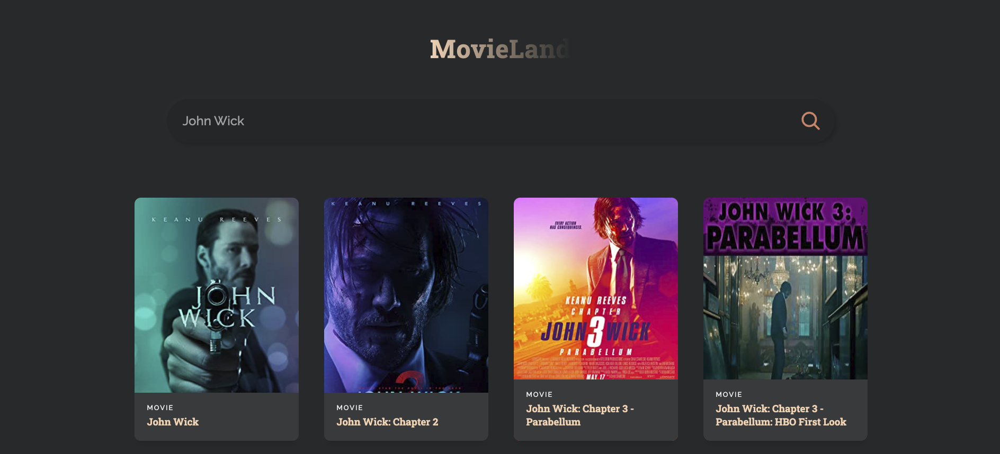

# MovieLand

This project is based from [JavaScript Mastery](https://www.youtube.com/watch?v=b9eMGE7QtTk) YouTube video.

This project is a movie search engine that gives you access to all movies you serach for.

### What I learned:

- to create a React application
- using different components
- react states and props

### Preview:

